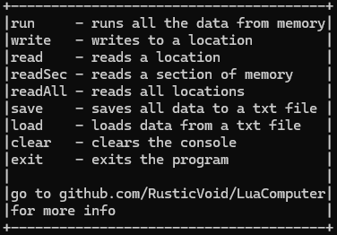

# LuaComputer
This is a semi-computer written in Lua.

### Plans
I plan on adding more to the jmp opcode like jumping to labels. <br>
I also plan on adding "if" statement opcodes, and user input opcode.

# Commands and opcodes
### Commands
there are 10 commands as of right now

1. help    - shows all commands<br>
<br>
2. run     - runs all the data from memory starting from location 0000 <br>
3. write   - writes to a specified location <br>
4. read    - reads a specified location <br>
5. readSec - reads a specified section of memory <br>
<br>
6. readAll - reads all memory <br>
7. save    - saves all data to a specified txt file <br>
8. load    - loads data from a specified txt file <br>
9. clear   - clears the console <br>
10. exit    - exits the program <br>

### Op Codes
there are 6 opcodes as of right now

1. jmp   - Jumps to a location in memory <br>
```
0000 jmp
0001 10 --This jumps to address 000a or 10
```
2. print - Prints that line under it <br>
```
0000 print
0001 Hello, World! --This prints "Hello, World!"
```
3. add   - Adds locations data together <br>
```
0000 add -- This adds locations 4 and 5
0001 4   -- and puts the sum at location 6
0002 5    
0003 6
0004 25  -- this is location 4
0005 10  -- this is location 5
0006 0   -- this is where the sum will be after running
```
4. sub   - subtracts locations data from another <br>
similar to the add op but subtraction
5. mul   - Multiplies locations data together <br>
similar to the add op but multiplication
6. break - ends the program at the location its placed in

# Programs

program 1: this program prints infinate numbers<br>
REMOVE ALL SPACES AND COMMENTS(Working on a fix)
```
0000 print - prints the sum from adding
0001 0     - where the sum is put
0002 add   - adds location 1 8 and puts the sum at 1
0003 1     - grabs data from location 1
0004 8     - grabs data from location 8
0005 1     - puts the sum of adding location 1 and location 8 at location 1
0006 jmp   - jumps to location 0
0007 0     - jumps to location 0
0008 1     - location 8 for adding
```


